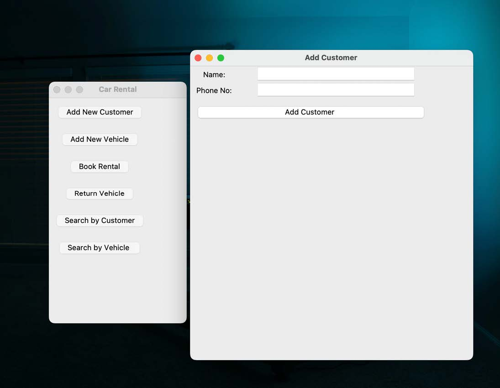
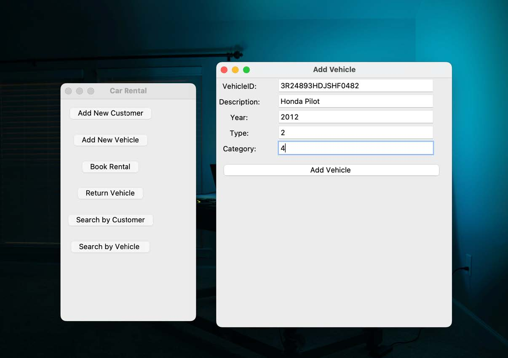
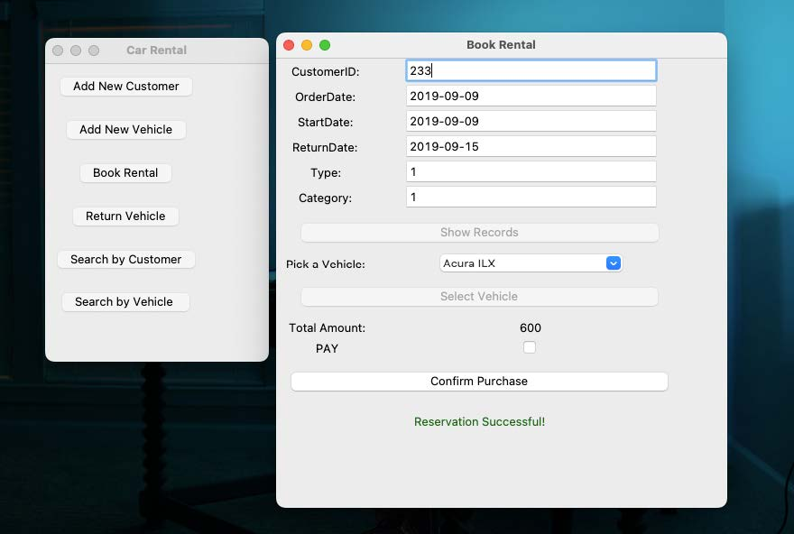
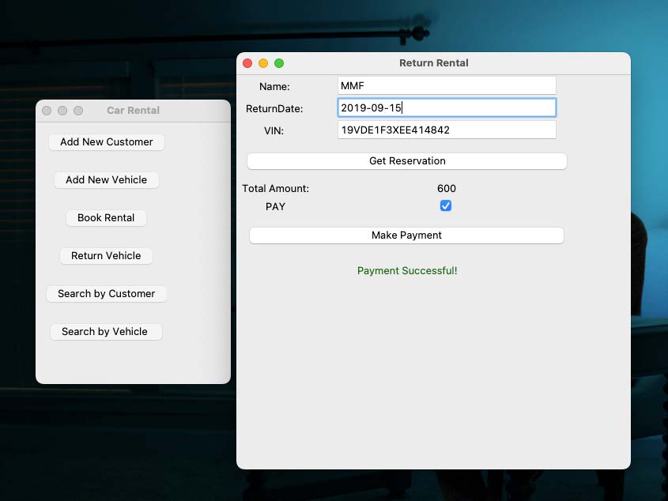

# CarRental
This repository houses a Car Rental Application that uses a database to manage customers, vehicles, and rental transactions. The user interacts with the application via a Graphical User Interface (GUI). The application was built using Python, with SQLite for database management.

# Table of Contents
- [CarRental](#carrental)
- [Table of Contents](#table-of-contents)
- [Creating Tables](#creating-tables)
- [Inserting the Data](#inserting-the-data)
- [Application Functionalities](#application-functionalities)
- [GUI Walkthrough](#gui-walkthrough)
- [Feedback](#feedback)
- [Copyright](#copyright)


# Creating Tables
The database for this application includes four tables: CUSTOMER, RATE, VEHICLE, and RENTAL. The SQL queries used to create these tables are as follows:
<details>
<summary>Click to view the SQL queries</summary>

**CUSTOMER** 
```
CREATE TABLE CUSTOMER(
    CustID INTEGER NOT NULL PRIMARY KEY AUTOINCREMENT,
    Name VARCHAR(255) NOT NULL,
    Phone VARCHAR(255) NOT NULL
); 
```

**RATE**
```
CREATE TABLE RATE (
    Type INT NOT NULL,
    Category INT NOT NULL,
    Weekly INT NOT NULL,
    Daily INT NOT NULL,
    PRIMARY KEY (Type, Category)
);
```

**VEHICLE**
```
CREATE TABLE VEHICLE(
      VehicleID Int NOT NULL,
      Description VARCHAR(255) NOT NULL,
      Year  INT  NOT NULL,
      Type  INT  NOT NULL,
      Category INT NOT NULL,
      PRIMARY KEY(VehicleID),
      FOREIGN KEY(Type, Category) REFERENCES RATE(Type,Category)
);
```

**RENTAL**
```
CREATE TABLE RENTAL(
    CustID INT NOT NULL,
    VehicleID VARCHAR(255) NOT NULL,
    StartDate DATE NOT NULL,
    OrderDate DATE NOT NULL,
    RentalType INT NOT NULL,
    Qty INT NOT NULL,
    ReturnDate DATE NOT NULL, 
    TotalAmount INT NOT NULL, 
    PaymentDate DATE,
    FOREIGN KEY (CustID) REFERENCES CUSTOMER(CustID),
    FOREIGN KEY (VehicleID) REFERENCES VEHICLE(VehicleID)
);
```
</details>

# Inserting the Data
The data was inserted into the database using CSV files and the following commands were executed:
```
.mode csv
.import CUSTOMER.csv CUSTOMER
.import RATE.csv RATE
.import VEHICLE.csv VEHICLE .import RENTAL.csv RENTAL
```

# Application Functionalities

The application is designed to perform the following tasks:

1. Add information about a new customer.
2. Add all the information about a new vehicle.
3. Add all the information about a new rental reservation.
4. Handle the return of a rented car, print the total customer payment due for that rental, enter it in the database, and update the returned attribute accordingly.
5. Return customer and vehicle reports with the following criteria:
    -  For every customer, display the ID, name, and any remaining balance.
    - For every vehicle, display the VIN, the description, and the average DAILY price.

# GUI Walkthrough

Below are some screenshots showing the working of the application:

1. **Application Homepage**


2. **Add Vehicle Page**


3. **Book Rental Page**


4. **Return Rental Page**


# Feedback
If you encounter any bugs or have suggestions for improvements, feel free to open an issue.

# Copyright
Copyright © 2023. All rights reserved.

This software is provided for educational purposes only. It is prohibited to use any of the code for any college assignment or personal use. Unauthorized distribution, modification or commercial usage is strictly forbidden. Please respect the rights of the author.


